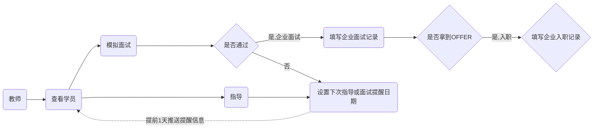

# EmploymentGuidanceTracking
便于跟踪提醒待就业学员的指导和模拟面试

### 主要工作流程

```mermaid
graph LR
T(教师)-->S(查看学员)
S-->MI(模拟面试)
MI-->P{是否通过}
P--是,企业面试-->EI(填写企业面试记录)
EI-->O{是否拿到OFFER}
P--否-->N(设置下次指导或面试提醒日期)
N-.提前1天推送提醒信息.->S
S-->G(指导)
G-->N
O--是,入职-->E{填写企业入职记录}
```

